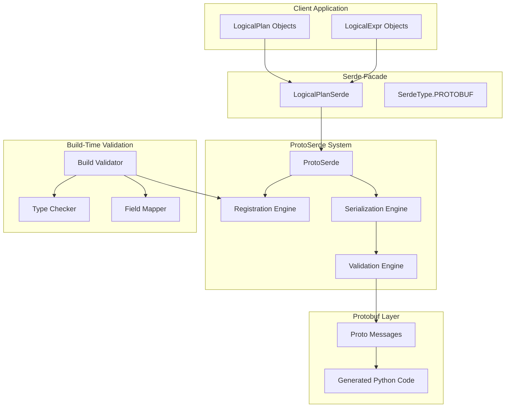

# Design Document

## Overview

The Protobuf Serialization System (ProtoSerde) is a comprehensive replacement for the current CloudPickle-based serialization in Fenic. The system provides type-safe, version-compatible, and extensible serialization for LogicalPlan and LogicalExpr objects using Protocol Buffers. The design emphasizes build-time validation, runtime safety, and seamless integration with the existing serde facade.

The system consists of four main components:

1. **Protobuf Schema Definitions** - Protocol buffer messages for all serializable types
2. **Registration System** - Type-safe mapping between Python classes and protobuf messages
3. **Serialization Engine** - Core serialization/deserialization logic with validation
4. **Integration Layer** - Seamless integration with existing serde facade

## Architecture

### High-Level Architecture



### Component Architecture

#### 1. Protobuf Schema Layer

The protobuf schema defines messages for all LogicalPlan and LogicalExpr types, following a hierarchical structure similar to DataFusion's approach but tailored for Fenic's specific needs.

**Naming Convention:**
All protobuf messages should have the same name as the type they are representing. We will create a `proto_types.py` in the `serde` package where we will import them all and rename them to include a `Proto` suffix, so we can use them in the code alongside their canonical python representations without naming conflicts.

**Core Message Structure:**

```protobuf
// Base message for all logical plans
message LogicalPlan {
  oneof plan_type {
    // Source operations
    InMemorySource in_memory_source = 1;
    FileSource file_source = 2;
    TableSource table_source = 3;
    
    // Transform operations
    Projection projection = 10;
    ...
  }
}

// Base message for all logical expressions
message LogicalExpr {
  oneof expr_type {
    ColumnExpr column = 1;
    LiteralExpr literal = 2;
    AliasExpr alias = 3;
    ...
    // Binary Exprs (groups can be separated to allow us to add new exprs to groups without disrupting compatibility)
    // We can also use the same proto message for cases like subclasses of BinaryExpr
    BinaryExpr arithmetic = 20;
    BinaryExpr equality_comparison = 21;
    BinaryExpr numeric_comparison = 22;
    BinaryExpr boolean_expr = 23;
    ...
  }
}
```

**Proto Organization:**

```
protos/logical_plan/v1/
├── plans.proto              # LogicalPlan subclasses
├── expressions.proto        # LogicalExpr subclasses
├── datatypes.proto          # DataType system messages
├── enums.proto             # System enums and constants
└── complex_types.proto     # Pydantic models, NumPy arrays, etc.
```

#### 2. Registration System

The registration system provides type-safe mapping between Python classes and protobuf messages with build-time validation. When a Type is registered in the SerdeRegistry with its equivalent Protobuf Class, we validate that all of the fields available on the Type are available in the protobuf, to avoid any runtime serde issues. If no serializer/deserializer methods are provided, they can be generated using by inspecting type hints.

**Core Components:**

- `SerdeRegistry`: Central registry for class-to-proto mappings
- `BuildTimeValidator`: Validates registrations at build time

**Registration API:**
We can use a similar approach as the Function Signature registry -- creating a registration API, 
then registering all of the types with the registry in __init__ files, so it happens at build time. 
This way, we can ensure that any issues with serde (conflicting names/types between Python and Protobuf) are caught early. We will want to always manually register types that depend on each other -- eg. we should manually register all LogicalExprs to ensure we do it in the right order. The alternative is lazy loading them as required, but that wouldn't give us the build time safety that we want. 

#### SerdeRegistry Interface

```python
from typing import TypeVar, Callable, Optional, Type

# Type variables for type-safe serialization
PythonType = TypeVar('PythonType')  # Python class type
ProtoMessageType = TypeVar('ProtoMessageType', bound=google.protobuf.message.Message)    # Protobuf message type


class SerdeRegistry:
    # Creates an EnumRegistration and validates that all named values on the python enum are present in the protobuf enum. If the field names in the proto enum differ from the python enum (because of protobuf's single enum namespace), provide mappings for each field with a differing name.
    @validate_call(config=ConfigDict(arbitrary_types_allowed=True))
    def register_enum(
        self,
        python_enum: Type[Enum],
        proto_enum: EnumTypeWrapper,
        field_mappings: Optional[Dict[Enum, EnumTypeWrapper]]
    ) -> None:
    
    # Creates a TypeRegistration and generates the required serializer/deserialzier if not provided. Validates that the serialization/deserialization will work.
    @validate_call
    def register_type(
        self,
        python_class: Type[PythonType],
        proto_class: Type[ProtoMessageType],
        serializer: Optional[Callable[[PythonType], ProtoMessageType]] = None,
        deserializer: Optional[Callable[[ProtoMessageType], PythonType]] = None,
        oneof_field: Optional[str] = None,  # Field name in the oneof wrapper (e.g., "column", "projection"). When registering a LogicalPlan or LogicalExpr subtype, this must be present. 
        proto_oneof_class: Optional[Type] = None  # The oneof wrapper class (e.g., LogicalExprNode, DataTypeNode). When registering a LogicalPlan or LogicalExpr subtype, this must be present. We will validate that the oneof exists in the class and that it matches the proto_class
    ) -> None:

    # Registers the type as non-serializable so we throw an error if it appears in a plan.
    def register_non_serializable(self, python_class: Type[PythonType])
        ...
    def get_type_registration(self, py_type: Type[PythonType]) -> TypeRegistration:
        ...
    def get_enum_registration(self, enum_type: Type[Enum]) -> EnumRegistration:
        ...
    def validate_all_registrations(self) -> ValidationResult:
        ...

# Examples

registry.register_type(
    python_class=Projection,
    proto_class=ProjectionProto,
    oneof_field="projection",
    proto_oneof_class=LogicalPlanProto,
)

# Registering Enums
register_enum(
    python_enum=Operator,
    proto_enum=OperatorProto,
)

# Or when enum values differ:
register_enum(
    python_enum=Operator,
    proto_enum=OperatorProto,
    field_mappings={
        Operator.ADD: OperatorProto.ADD_DIFFERENT,
    }
)

# Mapping enums is simpler, and can be done with the decorator.
@register_enum_serde(
    proto_enum=OperatorProto 
)
class Operator(Enum):
    ...

# If custom serialization is required, we can plug in pre-made serde functions
def serialize_in_memory_source(source: InMemorySource) -> InMemorySourceProto:
    ...
def deserialize_in_memory_source(source_proto: InMemorySourceProto) -> InMemorySource:
    ...

registry.register_type(
    python_class=InMemorySource,
    proto_class=InMemorySourceProto,
    serializer=serialize_in_memory_source,
    deserializer=deserialize_in_memory_source,
    oneof_field="in_memory_source",
    proto_oneof_class=LogicalPlanProto,
)

```


**@register_serde Decorator**

The decorators can be used on things like our `BaseModel` configuration classes, and `Enum` classes that don't have dependencies between them.

```python
def register_serde(
    proto_class: Type[ProtoType],
    field_mappings: Optional[Dict[str, str]] = None,
    custom_serializer: Optional[Callable[[PythonType], ProtoType]] = None,
    custom_deserializer: Optional[Callable[[ProtoType], PythonType]] = None,
    oneof_field: Optional[str] = None,  # Field name in the oneof wrapper
    proto_oneof_class: Optional[Type] = None  # The oneof wrapper class
):
    def decorator(cls):
        registry.register(
            python_class=cls,
            proto_class=proto_class,
            serializer=custom_serializer,
            deserializer=custom_deserializer,
            oneof_field=oneof_field,
            proto_oneof_class=proto_oneof_class
        )
        return cls
    return decorator

def register_enum_serde(
    proto_enum: EnumTypeWrapper,
):
    def decorator(enum_class):
        registry.register_enum(
            python_enum=enum_class,
            proto_enum=proto_enum,
        )
        return enum_class
    return decorator

```

#### 3. Serialization Engine

The serialization engine handles the core conversion logic with recursive traversal and validation.

**Key Features:**

- Recursive serialization of nested LogicalPlan/LogicalExpr trees
- Session state exclusion during serialization
- Session state restoration during deserialization
- Error handling with detailed diagnostics
- Optional compression support

#### 4. Validation Engine

The validation engine ensures type safety and data integrity throughout the serialization process. We'll want to allow the serde
classes to expose a `validate_plan` function that validates that the plan can be safely serialized (all types are registered and are serializble), that walks the plan to ensure that each field is serializable.

**Validation Layers:**

- Build-time: Field mapping, type compatibility, registration completeness
- Serialize-time: Object structure, required fields, type constraints, unserializable expressions
- Deserialize-time: Proto message validation, version compatibility

## Serialization Challenges Analysis

### Complex Data Types Requiring Special Handling

#### 1. Pydantic BaseModel Types

**Challenge**: Semantic expressions use Pydantic BaseModel classes for structured data:

- `response_format: Optional[type[BaseModel]]` in SemanticMapExpr
- `schema: type[BaseModel]` in SemanticExtractExpr
- Example collections (MapExampleCollection, ClassifyExampleCollection, etc.)

**Solution**:

Two distinct serialization strategies are needed:

1. **Pydantic Model Instances**: Serialize actual data objects using explicit protobuf messages
2. **Pydantic Model Types**: Serialize class/schema information for use as response format templates

**Detailed Implementation:**

```python
# Challenge 1: Serializing Pydantic model instances (actual data)
# Each Pydantic model is registered directly to its protobuf equivalent
@register_serde(proto_class=KeyPointsFormat)
class KeyPoints(BaseModel):
    max_points: int = 5

@register_serde(
    proto_class=MapExampleCollection,
    serializer=lambda obj: MapExampleCollection(
        examples=[MapExampleProto(input=ex.input, output=ex.output) for ex in obj.examples]
    ),
    deserializer=lambda proto: MapExampleCollection(
        examples=[MapExample(input=dict(ex.input), output=ex.output) for ex in proto.examples]
    )
)
class MapExampleCollection(BaseExampleCollection[MapExample]):
    # Custom serializers handle the complex nested structure
    pass

# Challenge 2: Serializing Pydantic model types (class information for response_format)
def serialize_pydantic_type(model_type: type[BaseModel]) -> PydanticModelType:
    schema_dict = model_type.model_json_schema()
    json_schema = json.dumps(schema_dict)
    return PydanticModelType(json_schema=json_schema)

def deserialize_pydantic_type(proto: PydanticModelType) -> type[BaseModel]:
    from jambo import SchemaConverter ## Jambo is a library that converts json schemas back into Pydantic Models
    schema_dict = json.loads(proto.json_schema)
    try:
        return SchemaConverter.convert(schema_dict)
    except Exception as e:
        raise SerializationError(f"Failed to convert schema to Pydantic model: {e}")
```

#### 2. Python Enum Types

**Challenge**:

- `labels: List[str] | type[Enum]` in SemanticClassifyExpr
- Various enum types throughout the system (SemanticSimilarityMetric, etc.)
- Enum locations may change between client/server versions
- Client and server may support different enum values

**Solution**:

- Create explicit protobuf enums for all known enum types used in serialization
- Eliminate user provided enums -- change the way SemanticClassify works so the user instead provides a list of BaseModel objects with
  the category and a description, to better inform the model what each category means.

#### 3. NumPy Arrays

**Challenge**:

- `other: Union[LogicalExpr, np.ndarray]` in EmbeddingSimilarityExpr
- Binary data that needs efficient serialization

**Solution**:

- Use protobuf `bytes` field with numpy's tobytes()/frombuffer()
- Include shape and dtype metadata for reconstruction
- Compression for large arrays

#### 4. Python Callable Objects (UDFExpr)

**Challenge**:

- `func: Callable` in UDFExpr contains arbitrary Python code
- Cannot be serialized safely across process boundaries

**Solution**:

- Mark UDFExpr as non-serializable
- Provide clear error messages when encountered
- Document cloud execution limitations

#### 5. Fenic DataType System

**Challenge**:

- Complex hierarchy of DataType classes with various parameters
- EmbeddingType, StructType, ArrayType with nested structures
- Singleton types vs parameterized types

**Solution**:

- Create comprehensive protobuf messages for all DataType variants
- Use oneof unions for type discrimination
- Special handling for singleton types (StringType, IntegerType, etc.)

#### 6. Session State References

**Challenge**:

- LogicalPlan objects contain session_state references
- Cannot serialize session state across boundaries
- Need to restore session state on deserialization

**Solution**:

- Exclude session state during serialization (already implemented in CloudPickle)
- Restore session state during deserialization
- Validate session compatibility


## Components and Interfaces

### Core Interfaces

#### ProtoSerde Interface

```python
class ProtoSerde(LogicalPlanSerializer, LogicalPlanDeserializer):
    def serialize(self, plan: LogicalPlan) -> bytes
    def deserialize(self, data: bytes, session_state: Optional[BaseSessionState]) -> LogicalPlan
    def serialize_with_compression(self, plan: LogicalPlan, compression: CompressionType) -> bytes
    def get_serialization_stats(self) -> SerializationStats
```

## Data Models

### Protobuf Message Hierarchy

#### LogicalPlan Messages

```protobuf
message Projection {
  LogicalPlan input = 1;
  repeated LogicalExpr expressions = 2;
}

message Join {
  LogicalPlan left = 1;
  LogicalPlan right = 2;
  string join_type = 3; // in this initial impl, Literals will be str
  repeated LogicalExpr left_keys = 4;
  repeated LogicalExpr right_keys = 5;
  optional LogicalExpr filter = 6;
}

message Aggregate {
  LogicalPlan input = 1;
  repeated LogicalExpr group_exprs = 2;
  repeated LogicalExpr agg_exprs = 3;
}

message InMemorySource {
  bytes dataframe_data = 1;  // Serialized polars DataFrame
  Schema schema = 2;
}

```

#### LogicalExpr Messages

```protobuf
message ColumnExpr {
  string name = 1;
}

message LiteralExpr {
  oneof value_type {
    string string_value = 1;
    int64 int_value = 2;
    double double_value = 3;
    bool bool_value = 4;
    bytes bytes_value = 5;
    ... //all types we support for LiteralExpr
  }
  DataType data_type = 6;
}

message BinaryExpr {
  LogicalExpr left = 1;
  LogicalExpr right = 2;
  Operator operator = 3;
}

message AliasExpr {
  LogicalExpr expr = 1;
  string name = 2;
}

message SemanticMapExpr {
  string instruction = 1;
  repeated LogicalExpr exprs = 2;  // Parsed from instruction
  int32 max_tokens = 3;
  float temperature = 4;
  optional string model_alias = 5;
  optional PydanticModelType response_format = 6;
  optional MapExampleCollection examples = 7;
}

message EmbeddingSimilarityExpr {
  LogicalExpr expr = 1;
  oneof other_type { // requires custom serde
    LogicalExpr other_expr = 2;
    NumpyArray query_vector = 3;
  }
  string metric = 4;
}
```


#### DataType Messages

```protobuf
message DataType {
  oneof data_type {
    StringType string = 1;
    IntegerType integer = 2;
    FloatType float = 3;
    DoubleType double = 4;
    BooleanType boolean = 5;
    ArrayType array = 6;
    StructType struct = 7;
    EmbeddingType embedding = 8;
    TranscriptType transcript = 9;
    DocumentBackedPath document_backed_path = 10;
    MarkdownType markdown = 11;
    HTMLType html = 12;
    JSONType json = 13;
  }
}

```

#### Enum Handling Messages

```protobuf
// Binary operators for expressions
enum Operator {
  EQ = 1;
  NOT_EQ = 2;
  LT = 3;
  LTEQ = 4;
  GT = 5;
  GTEQ = 6;
  PLUS = 7;
  MINUS = 8;
  MULTIPLY = 9;
  DIVIDE = 10;
  AND = 11;
  OR = 12;
}
```

#### Pydantic Model Messages

```protobuf
// For serializing Pydantic model types/schemas (class information)
message PydanticModelType {
    string json_schema = 1;
}

message MapExampleCollection {
  repeated MapExample examples = 1;
}

message MapExample {
  map<string, string> input = 1;
  string output = 2;
}
```

#### NumPy Array Messages

```protobuf
message NumpyArray {
  bytes data = 1;
  repeated int32 shape = 2;
  string dtype = 3;
}
```


**NumPy Array Reconstruction Process:**

```python
def serialize_numpy_array(arr: np.ndarray) -> NumpyArray:
    """Serialize numpy array to protobuf message."""
    # Convert array to bytes using numpy's native serialization
    data_bytes = arr.tobytes()

    return NumpyArray(
        data=data_bytes,
        shape=list(arr.shape),
        dtype=str(arr.dtype)
    )

def deserialize_numpy_array(proto: NumpyArray) -> np.ndarray:
    """Reconstruct numpy array from protobuf message."""
    # Reconstruct array using numpy.frombuffer
    arr = np.frombuffer(proto.data, dtype=proto.dtype)

    # Reshape to original dimensions
    return arr.reshape(proto.shape)
```

### Type Mapping System

#### Field Mapping Configuration
```python
@dataclass
class FieldMapping:
    python_field: str
    proto_field: str
    serializer: Optional[Callable[[Any], Any]] = None  # Python field value -> Proto field value
    deserializer: Optional[Callable[[Any], Any]] = None  # Proto field value -> Python field value
    required: bool = True
    default_value: Any = None

@dataclass
class TypeRegistration(Generic[PythonType, ProtoMessageType]):
    python_class: Type[PythonType]
    proto_class: Type[ProtoType]
    field_mappings: List[FieldMapping]
    serializer: Callable[[PythonType], ProtoType]
    deserializer: Callable[[ProtoType], PythonType]
    oneof_field: Optional[str] = None  # Field name in the oneof wrapper
    proto_oneof_class: Optional[Type] = None  # The oneof wrapper class

@dataclass
class EnumRegistration:
    """Registration information for an enum to protobuf mapping."""
    enum_class: Type[Enum]
    proto_enum: EnumTypeWrapper  # The protobuf enum type wrapper
    field_mappings: Optional[dict[Enum, EnumTypeWrapper]]

def serialize_enum(enum_value: Enum, proto_enum: EnumTypeWrapper) -> int:
    """Generic enum serializer that works for all registered enums."""
    if not field_mappings:
        return proto_enum.Value(enum_value.name)
    ...

def deserialize_enum(enum_int: int, enum_class: Type[Enum], proto_enum: EnumTypeWrapper) -> Enum:
    """Generic enum deserializer that works for all registered enums."""
    if not field_mappings:
        enum_name = proto_enum.Name(enum_int)
        return enum_class[enum_name]
    ...
```

#### Automatic Field Mapping Inference

The registration system can automatically infer field mappings through introspection, eliminating the need for manual configuration in most cases:

```python
class FieldMapper:
    """Automatically infers field mappings between Python classes and protobuf messages."""

    def infer_field_mappings(self, python_class: Type, proto_class: Type) -> List[FieldMapping]:
        """Infer field mappings using reflection and type hints."""
        mappings = []

        # Get Python class fields from __init__ signature or dataclass fields
        python_fields = self._get_python_fields(python_class)

        # Get protobuf message fields from generated class
        proto_fields = self._get_proto_fields(proto_class)

        # Match fields by name
        for py_field_name, py_field_info in python_fields.items():
            proto_field_name = self._find_matching_proto_field(py_field_name, proto_fields)

            if proto_field_name:
                serializer = self._infer_field_serializer(py_field_info.type, proto_fields[proto_field_name])
                deserializer = self._infer_field_deserializer(py_field_info.type, proto_fields[proto_field_name])
                ...

        return mappings

    def _get_python_fields(self, python_class: Type) -> Dict[str, FieldInfo]:
        """Extract field information from Python class."""
        fields = {}

        # Handle dataclasses
        if hasattr(python_class, '__dataclass_fields__'):
            for name, field in python_class.__dataclass_fields__.items():
                fields[name] = FieldInfo(
                    name=name,
                    type=field.type,
                    required=field.default == dataclasses.MISSING,
                    default=field.default if field.default != dataclasses.MISSING else None
                )

        # Handle regular classes via __init__ signature
        else:
            sig = inspect.signature(python_class.__init__)
            for param_name, param in sig.parameters.items():
                if param_name == 'self':
                    continue

                fields[param_name] = FieldInfo(
                    name=param_name,
                    type=param.annotation,
                    required=param.default == inspect.Parameter.empty,
                    default=param.default if param.default != inspect.Parameter.empty else None
                )

        return fields

    def _find_matching_proto_field(self, py_field_name: str, proto_fields: Dict) -> Optional[str]:
        """Find matching protobuf field using naming conventions."""
        # Direct match
        if py_field_name in proto_fields:
            return py_field_name

        # Snake_case to camelCase conversion
        camel_case = self._to_camel_case(py_field_name)
        if camel_case in proto_fields:
            return camel_case

        return None

    def _infer_field_serializer(self, py_type: Type, proto_field_info) -> Optional[Callable]:
        """Infer type converter based on type mismatch patterns."""
        if isinstance(py_type, (bool, int, float, str, bytes)):
            #Validate that the types match between the 
            return None  # No conversion needed
        
        origin = typing.get_origin(py_type)
        elif origin is Union:
            args = typing.get_args(py_type)
            # Check if this is Optional[T] (which is Union[T, None])
            if len(args) == 2 and type(None) in args:
                # Get the non-None type
                underlying_type = args[0] if args[1] is type(None) else args[1]
                # Recursively call with the underlying type
                return self._infer_serializer(underlying_type, proto_field_info)
            else:
                ...

        elif issubclass(py_type, Enum):
            enum_registration = get_registry().get_enum_registration(py_type)
            if enum_registration:
                # Use the generic enum serializer with the registered proto_enum
                return lambda enum_val: serialize_enum(enum_val, enum_registration.proto_enum)
            else:
                raise SerializationError(f"Enum type {py_type} is not registered for serialization")
        
        type_registration = get_registry().get_type_registration(py_type)
        if type_registration:
            if not type_registration.proto_oneof_class
                return type_registration.serializer
            else:
                return lambda obj: registration.proto_oneof_class(**{registration.oneof_field: type_registration.serializer(obj)})

        # Could not infer a serialzier for this py_type
        raise ...

```

#### Automatic Serializer/Deserializer Generation

When custom serializers/deserializers are not provided, the system automatically generates them based on field mappings:

```python
class SerializerGenerator:
    """Generates serializers and deserializers automatically from field mappings."""

    def generate_serializer(
        self, 
        python_class: Type[PythonType], 
        proto_class: Type[ProtoMessageType],
        field_mappings: List[FieldMapping]
    ) -> Callable:
        """Generate a serializer function from field mappings."""
        def auto_serializer(obj: python_class) -> proto_class:
            proto_obj = proto_class()

            for mapping in field_mappings:
                # Get value from Python object
                py_value = getattr(obj, mapping.python_field)

                # Apply serialization if needed
                if mapping.serializer:
                    proto_value = mapping.serializer(py_value)
                else:
                    proto_value = py_value

                # Set value on protobuf object
                if isinstance(proto_value, ProtoMessage):
                    getattr(proto_obj, mapping.proto_field).CopyFrom(proto_value)
                setattr(proto_obj, mapping.proto_field, proto_value)

            return proto_obj

        return auto_serializer

    def generate_deserializer(
        self,        
        python_class: Type[PythonType], 
        proto_class: Type[ProtoMessageType],
        field_mappings: List[FieldMapping]
    ) -> Callable:
        """Generate a deserializer function from field mappings."""
        def auto_deserializer(proto_obj: proto_class) -> python_class:
            # Collect constructor arguments
            kwargs = {}

            for mapping in field_mappings:
                # Get value from protobuf object
                if hasattr(proto_obj, mapping.proto_field):
                    proto_value = getattr(proto_obj, mapping.proto_field)

                    # Apply deserialization if needed
                    if mapping.deserializer:
                        py_value = mapping.deserializer(proto_value)
                    else:
                        py_value = proto_value

                    kwargs[mapping.python_field] = py_value
                elif not mapping.required:
                    # Use default value for optional fields
                    kwargs[mapping.python_field] = mapping.default_value
                else:
                    raise DeserializationError(f"Required field {mapping.python_field} missing from protobuf")

            # Construct Python object
            return registration.python_class(**kwargs)

        return auto_deserializer
```

This approach provides:

- **Zero-configuration** for simple cases
- **Flexibility** for complex custom serialization needs
- **Build-time safety** through comprehensive validation
- **Maintainability** through automatic inference and generation

## Error Handling

### Error Hierarchy

```python
class SerdeError(Exception):
    """Base exception for serialization errors."""
    pass

class RegistrationError(SerdeError):
    """Errors during type registration."""
    pass

class SerializationError(SerdeError):
    """Errors during serialization."""
    def __init__(self, message: str, object_type: Type, field_path: str):
        self.object_type = object_type
        self.field_path = field_path
        super().__init__(f"{message} at {field_path} in {object_type.__name__}")

class DeserializationError(SerdeError):
    """Errors during deserialization."""
    pass
```

## Testing Strategy

### Unit Testing Approach

#### 1. Registration System Tests

- Test decorator functionality and registration validation
- Verify build-time validation catches missing registrations
- Test field mapping validation and type checking
- Validate error messages and diagnostics

#### 2. Serialization Round-Trip Tests

- Test serialization/deserialization for all LogicalPlan types
- Verify nested structure preservation
- Test session state handling (exclusion/restoration)
- Validate error handling for malformed data

#### 3. Compatibility Tests

- Test backward compatibility with older protobuf versions
- Verify forward compatibility with unknown fields
- Test version migration scenarios
- Validate graceful degradation

#### 4. Performance Tests

- Benchmark serialization speed vs CloudPickle
- Measure serialized size comparison
- Test compression effectiveness
- Memory usage profiling

### Integration Testing

#### 1. End-to-End Workflow Tests

```python
def test_complete_serialization_workflow():
    # Create complex LogicalPlan with nested expressions
    plan = create_complex_plan()

    # Serialize using ProtoSerde
    proto_serde = ProtoSerde()
    serialized = proto_serde.serialize(plan)

    # Deserialize with session state
    deserialized = proto_serde.deserialize(serialized, session_state)

    # Verify functional equivalence
    assert_plans_equivalent(plan, deserialized)
```

#### 2. Facade Integration Tests

```python
def test_serde_facade_integration():
    # Test seamless switching between CloudPickle and ProtoSerde
    serde_cloudpickle = LogicalPlanSerde(SerdeType.CLOUD_PICKLE)
    serde_proto = LogicalPlanSerde(SerdeType.PROTOBUF)

    plan = create_test_plan()

    # Both should produce functionally equivalent results
    cp_result = serde_cloudpickle.serialize(plan)
    proto_result = serde_proto.serialize(plan)

    # Cross-compatibility not required, but functional equivalence is
    cp_deserialized = serde_cloudpickle.deserialize(cp_result, session_state)
    proto_deserialized = serde_proto.deserialize(proto_result, session_state)

    assert_plans_equivalent(cp_deserialized, proto_deserialized)
```

### Build-Time Validation Tests

#### 1. Registration Completeness

```python
def test_all_types_registered():
    """Ensure all LogicalPlan and LogicalExpr subclasses are registered."""
    validator = BuildTimeValidator()
    result = validator.validate_registration_completeness()

    if not result.is_valid:
        pytest.fail(f"Unregistered types found: {result.missing_types}")
```

#### 2. Field Mapping Validation

```python
def test_field_mappings_valid():
    """Ensure all field mappings are correct and complete."""
    validator = BuildTimeValidator()
    result = validator.validate_field_mappings()

    assert result.is_valid, f"Field mapping errors: {result.errors}"
```

# Implementation Goals

## Performance Considerations

### Serialization Performance

- **Target**: Serialization time within 2x of CloudPickle for typical plans
- **Optimization**: Lazy field evaluation, efficient proto message construction
- **Monitoring**: Built-in performance metrics and profiling hooks

### Memory Usage

- **Target**: Memory usage comparable to CloudPickle during serialization
- **Optimization**: Streaming serialization for large plans, object pooling
- **Monitoring**: Memory profiling integration

### Compression Analysis

- **Evaluation**: Compare gzip, lz4, and zstd compression algorithms
- **Metrics**: Compression ratio, compression/decompression speed
- **Decision**: Provide configurable compression with sensible defaults

### Size Optimization

- **Target**: Serialized size within 1.5x of CloudPickle
- **Techniques**: Efficient encoding, optional field omission, schema optimization
- **Measurement**: Automated size comparison in test suite

## Security Considerations

### Input Validation

- Strict protobuf message validation before deserialization
- Size limits on serialized data to prevent DoS attacks
- Validation of all field values against expected ranges/types

### Safe Deserialization

- No arbitrary code execution during deserialization (unlike CloudPickle)
- Controlled object construction with validated inputs
- Session state isolation and validation

### Version Security

- Validation of protobuf schema versions
- Rejection of malformed or suspicious protobuf messages
- Audit logging of serialization/deserialization operations
